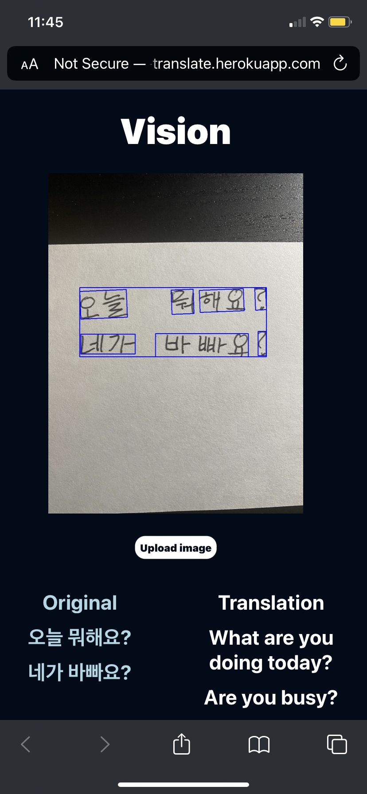

# image-translate
Given an image containing a supported foreign language, the app detects any text from it and translates it to English. The app uses [Google Cloud Vision](https://cloud.google.com/vision) to detect text, [OpenCV](https://pypi.org/project/opencv-python/) for image processing, and [Naver Papago](https://developers.naver.com/docs/papago/README.md) for translation. App created using React and Flask, and deployed on Heroku at [https://image-translate.herokuapp.com/](https://image-translate.herokuapp.com/) . Currently only supports translation TO English. Future updates will add more languages.

